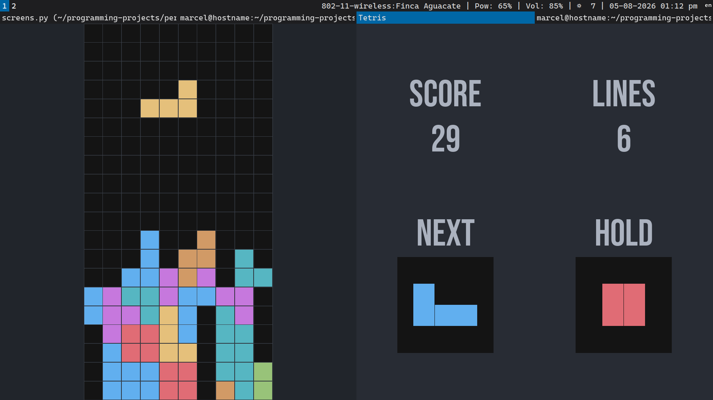

# Python Tetris
This a simple implementation of **Tetris** written in pure `Python`.
The only dependency is `pygame-ce`. 

https://github.com/user-attachments/assets/68cebf51-8430-4147-9704-25a14c0bc800



## Key Features
- Coded in pure `Python`
- Keyboard support
- Minimalist design
- Sound effects
- Modify game parameters (`board height, width, diffculty`) through command line args.

## Installation and requirements
Just **copy-paste** the following commands. The only requirement is
`pygame-ce`.

```
git clone https://github.com/MarcelAngulo/python-tetris.git
cd python-tetris
pip install -r requirements.txt
python main.py
```

## Usage
To play the game, just run
```
python ./main.py
```
It will appear a huge board with a falling block (left side) and a 
panel with some text (right side)
You can use `LEFT`, `RIGHT`, `DOWN` and `UP` keys to move the falling
block towards left, right, down or to rotate it. Press `SPACE` to drop
falling block. To interchange blocks, press `c` or `i`. 
Vim-like keybindings are allowed too (`h`, `j`, `k`, `l`).
When the board is full and no falling block can be generated, a game over
screen will appear showing your final score.
Key `q` closes the game and key `r` restarts it. To pause the game or to
see available key bindings, press `p`.


Here is an example of a game session of 10x30 grid with diffculty 100
```
python main.py -w 10 -H 30 -d 100
```

For **more information**, run `python main.py --help`
